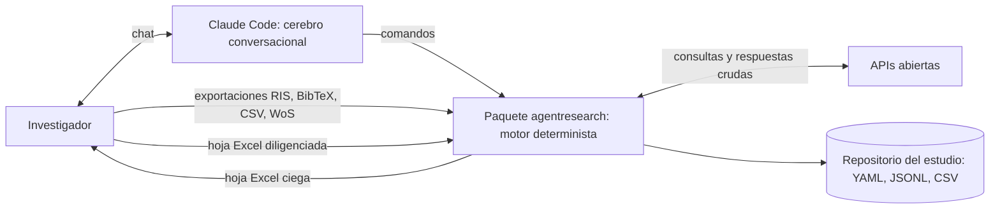

# Arquitectura

Documento vivo. Las decisiones que lo sustentan están en [decisiones/](decisiones/README.md), sobre todo ADR-0001 y ADR-0004. Los nombres de módulos y comandos son una propuesta: se confirman al implementar cada hito.

## Visión general



- Claude Code conversa, pregunta, propone opciones y emite juicios.
- El paquete ejecuta, valida y registra.
- Nada entra al repositorio del estudio sin pasar por un comando del paquete.

## Dos repositorios

1. **`agentresearch` (este repositorio): la herramienta.** Contiene código, pruebas, documentación y las plantillas que se instalan en cada estudio. Es público, con licencia MIT.
2. **Un repositorio por estudio: los datos y la evidencia.** Se crea con un comando del paquete, fija la versión exacta del agente y se archiva en Zenodo al publicar. Sus datos van con CC BY 4.0.

## Módulos del paquete (`src/agentresearch/`)

| Módulo | Responsabilidad | Hito |
|---|---|---|
| `cli` | Interfaz de línea de comandos (`agentresearch …`) | 0 |
| `trazabilidad` | Registro JSONL de solo adición, hashes SHA-256, versiones, fecha y hora UTC | 1 |
| `protocolo` | Modelo del protocolo (PCC/PICOC, preguntas, criterios, reglas, facetas), validación, enmiendas, generación de ecuaciones por fuente | 1 |
| `registros` | Modelo normalizado de registro bibliográfico y de estudio (artículo ≠ estudio), procedencia | 2 |
| `importacion` | Lectores de RIS, BibTeX, CSV de Scopus, WoS (.txt) y CSV genérico | 2 |
| `fuentes` | Conectores de OpenAlex, PubMed, Semantic Scholar, Springer Nature OA, Crossref y AGROVOC; caché de respuestas crudas y control de tasa | 3 |
| `deduplicacion` | Coincidencia por DOI y por título difuso más año; grupos de duplicados; regla aplicada en cada fusión | 4 |
| `cribado` | Prefiltros deterministas, lotes para el LLM, hojas Excel, reglas A–F, concordancia, conciliación | 5 |
| `bola_de_nieve` | Iteraciones hacia atrás y hacia adelante con registro de origen | 6 |
| `texto_completo` | Vínculo entre PDF y registro por hash, extracción de texto, cribado de texto completo | 7 |
| `extraccion` | Formulario de extracción, esquema de clasificación, *keywording*, evaluación de calidad opcional | 8 |
| `analisis` | Conteos por faceta, series temporales, mapas de burbujas y de calor | 9 |
| `reporte` | Diagrama de flujo, checklist PRISMA-ScR, tabla de estudios, declaración de IA | 10 |
| `prompts/` | Prompts versionados de cada tarea del LLM (archivos de texto) | 5 |
| `estudio` | Creación del repositorio de un estudio (`nuevo-estudio`) y sus plantillas: `CLAUDE.md` del estudio, configuración y *skills* de Claude Code (ADR-0007) | 1 |

## Estructura del repositorio de un estudio

`agentresearch nuevo-estudio` crea la raíz y `protocolo/` (ADR-0007); cada hito crea sus carpetas cuando las usa.

```text
mi-estudio/
├── CLAUDE.md                     # comportamiento del agente en este estudio (desde plantilla)
├── .claude/                      # settings.json (modelo fijado y permisos) y skills/protocolo/
├── estudio.yaml                  # metadatos, versión exacta del agente y modelo fijado
├── pyproject.toml, uv.lock       # proyecto uv que fija el agente a la etiqueta de su versión
├── README.md, .gitignore, .gitattributes
├── .borradores/                  # archivos intermedios de Claude Code (no se versiona)
├── protocolo/
│   ├── protocolo.yaml            # versión actual
│   ├── eventos.jsonl             # creación, aprobación, enmiendas y decisiones (ADR-0007 y ADR-0008)
│   ├── anclaje.json              # número de eventos y hash del último
│   ├── versiones/                # copia exacta de cada versión registrada (X.Y.Z.yaml)
│   ├── ecuaciones.md             # ecuaciones de búsqueda por fuente (ADR-0009)
│   └── insumos/                  # insumos del investigador (--contexto)
├── busquedas/
│   └── <fuente>/<fecha-hora>/    # consulta.json, respuesta cruda, conteo
├── importaciones/                # archivos exportados originales + hash
├── registros/
│   ├── registros.csv             # registros normalizados con procedencia
│   └── duplicados.csv            # grupos y regla aplicada
├── cribado/
│   ├── lotes/                    # lote-NNNN.entrada.json / lote-NNNN.respuesta.json
│   ├── revision_humana/          # hojas Excel exportadas e importadas
│   ├── decisiones.jsonl          # registro de decisiones (solo adición)
│   └── concordancia.json
├── bola_de_nieve/                # iteraciones y origen de cada candidato
├── texto_completo/               # hashes y DOI (los PDF no se versionan)
├── extraccion/                   # formulario, esquema de clasificación y datos extraídos
└── reportes/                     # diagrama de flujo, checklist, tablas, mapas, declaración de IA
```

## Interacción con el LLM (cribado y clasificación)

1. **Preparar el lote.** `agentresearch cribado preparar-lote` crea `lote-NNNN.entrada.json`. El lote incluye:
   - los registros (ID, título, resumen, palabras clave);
   - los criterios vigentes;
   - el hash del prompt.

   Nunca incluye decisiones de otros revisores. El tamaño por defecto es de unos 25 registros y se configura en el protocolo.
2. **Responder.** Claude Code lee el prompt versionado y el lote, y escribe `lote-NNNN.respuesta.json` siguiendo el esquema.
3. **Registrar.** `agentresearch cribado registrar --lote NNNN --modelo <identificador exacto>` valida:
   - el esquema;
   - que cada ID de registro pertenezca al lote;
   - que cada criterio exista en el protocolo;
   - que la evidencia aparezca literalmente en el registro;
   - que no falte ningún registro.

   Si todo es correcto, añade las decisiones a `decisiones.jsonl`. Si no, rechaza con errores explícitos para que Claude corrija.
4. **Retomar.** `agentresearch estado` muestra los lotes pendientes, para retomar después de agotar la cuota del plan.

## Revisión humana con Excel

1. `agentresearch cribado exportar-excel --revisor <id>` genera una hoja con los registros y columnas de decisión y criterio, con listas desplegables. No incluye decisiones del LLM.
2. El investigador la diligencia fuera de línea.
3. `agentresearch cribado importar-excel` la valida con las mismas reglas del LLM (salvo la evidencia literal, que es opcional para humanos), guarda su hash y añade las decisiones al registro.

## Esquema de una decisión (propuesta)

```json
{
  "id": "dec-000123",
  "fecha_hora_utc": "2026-10-02T15:04:05Z",
  "fase": "cribado_titulo_resumen",
  "id_registro": "reg-000456",
  "revisor": {"tipo": "llm", "id": "claude", "modelo": "<identificador exacto del modelo>"},
  "decision": "excluir",
  "criterios": ["CE2"],
  "evidencia": "fragmento literal del título o del resumen",
  "justificacion": "texto breve",
  "lote": "lote-0007",
  "version_protocolo": "1.2.0",
  "hash_prompt": "sha256:…",
  "version_agente": "0.3.0+abc1234",
  "ciego": true
}
```

## Comportamiento del agente en un estudio

Estas reglas van en las plantillas del estudio, no en el `CLAUDE.md` de desarrollo.

- **Guía por fases** con un comando (*skill*) por fase, por ejemplo: `/protocolo`, `/busqueda`, `/importar`, `/deduplicar`, `/cribado`, `/bola-de-nieve`, `/texto-completo`, `/extraccion`, `/analisis`, `/reporte` y `/estado`.
- **Una pregunta a la vez.** El agente explica para qué sirve cada dato en la metodología.
- **Opciones cuando falta información.** Si el investigador no sabe qué responder, el agente propone de 2 a 4 opciones construidas a partir de lo ya dicho, cada una con pros, contras y su referencia metodológica. La elección y las alternativas se registran.
- **Fases en orden.** El agente no avanza de fase sin la verificación de la anterior (`agentresearch estado`).
- **Advertencias metodológicas.** El agente advierte cuando algo contradice las guías, por ejemplo criterios que exigen evaluación empírica en un mapeo o una ecuación que restringe por contexto.

## Dependencias candidatas

Hay que verificar la licencia y la versión de cada una al incorporarla.

| Uso | Paquete | Licencia |
|---|---|---|
| CLI | typer | MIT |
| Modelos y validación | pydantic | MIT |
| YAML que conserva comentarios | ruamel.yaml | MIT |
| HTTP | httpx | BSD-3 |
| RIS | rispy | MIT |
| BibTeX | bibtexparser | MIT |
| Coincidencia difusa | rapidfuzz | MIT |
| Tablas | pandas | BSD-3 |
| Excel | openpyxl | MIT |
| Gráficos | matplotlib | Licencia de matplotlib (permisiva, basada en PSF) |
| Texto de PDF | pypdf | BSD-3 |
| Variables de entorno | python-dotenv | BSD-3 |
| Pruebas | pytest, pytest-cov, respx | MIT, MIT, BSD-3 |
| Calidad | ruff, mypy | MIT, MIT |

PyMuPDF queda excluido por su licencia AGPL.

## Estrategia de pruebas

- **Pruebas unitarias por módulo.** Usan datos sintéticos creados para las pruebas, nunca registros con derechos de autor.
- **Sin red.** Las APIs se simulan con `respx`; las pruebas en vivo llevan la marca `en_vivo` y no corren en CI.
- **Casos de rechazo.** Cubren toda validación: evidencia no literal, criterio inexistente, registro faltante, esquema inválido.
- **Prueba de reproducibilidad.** Ejecutar dos veces el pipeline sobre el mismo repositorio de estudio de ejemplo debe producir salidas idénticas, comparadas por hash.
- **Integración continua.** GitHub Actions corre ruff, mypy y pytest en Windows y Ubuntu.
